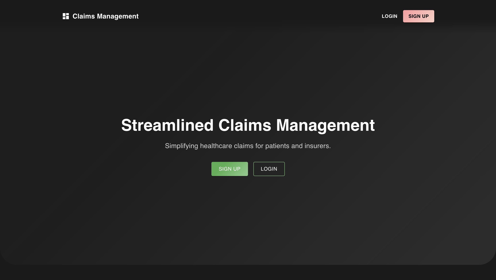
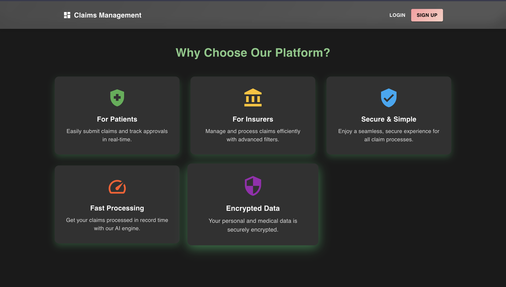
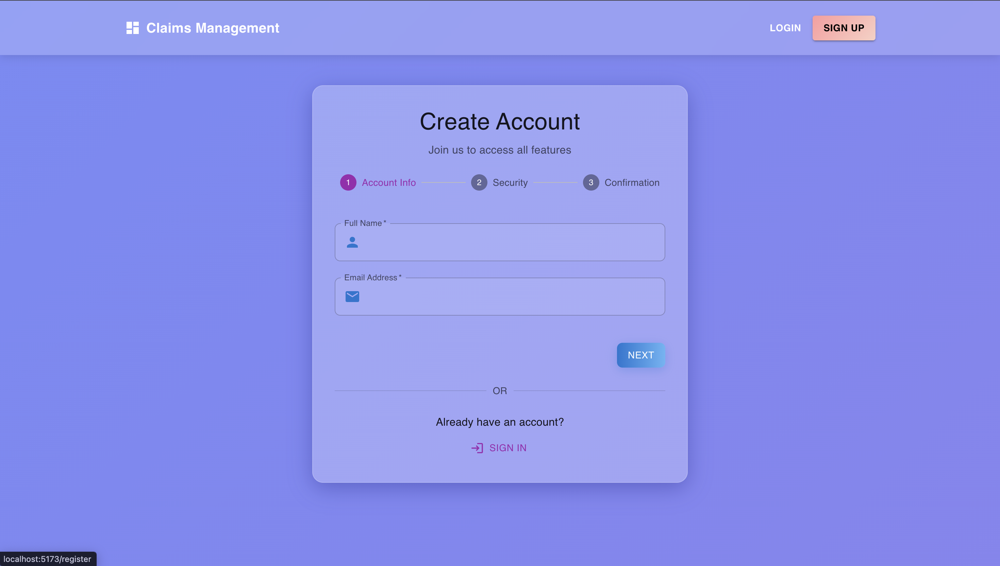
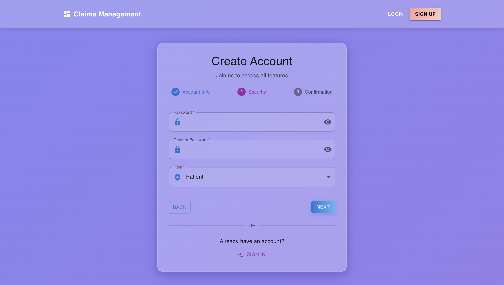
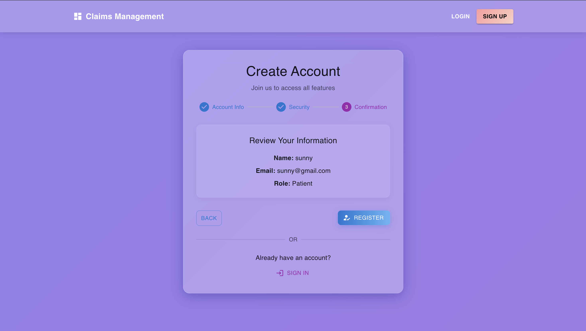
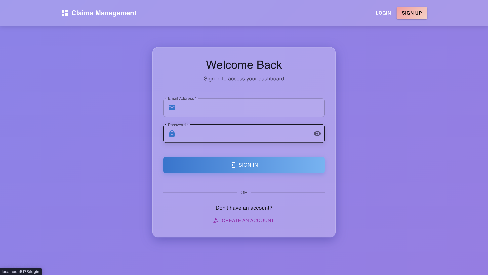
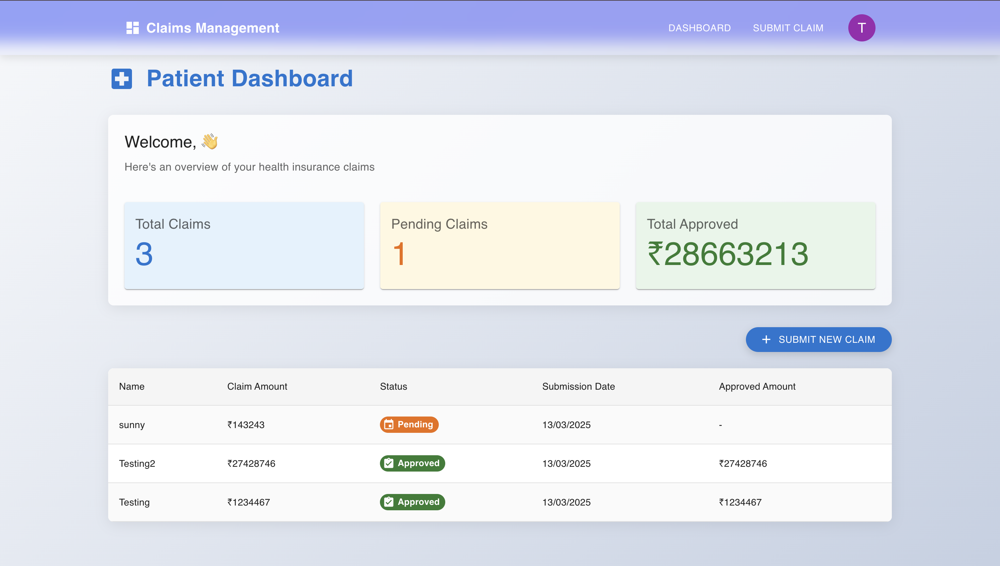
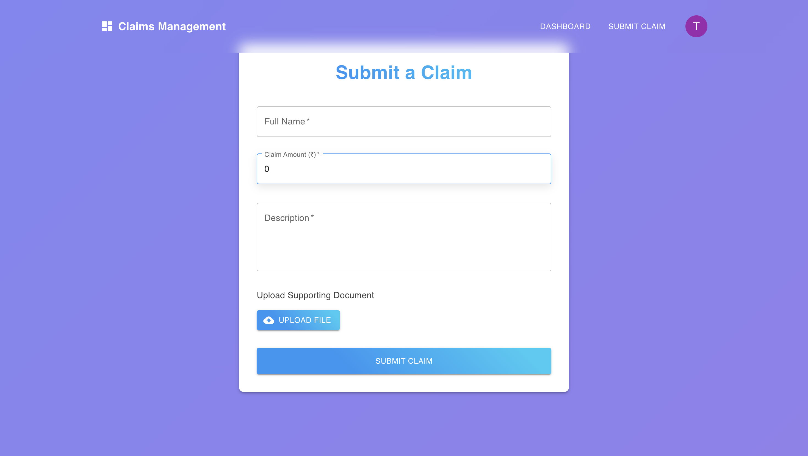
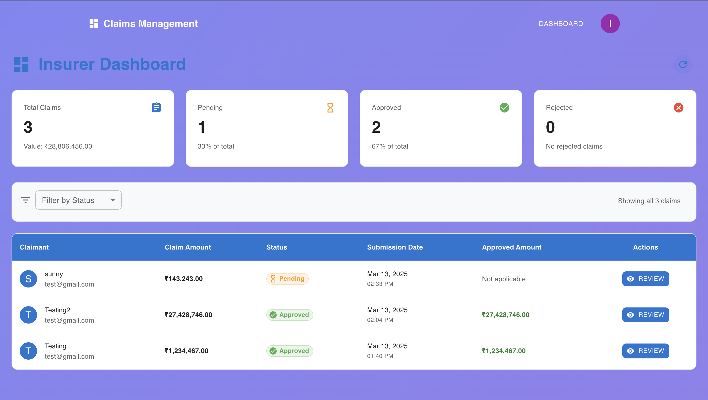
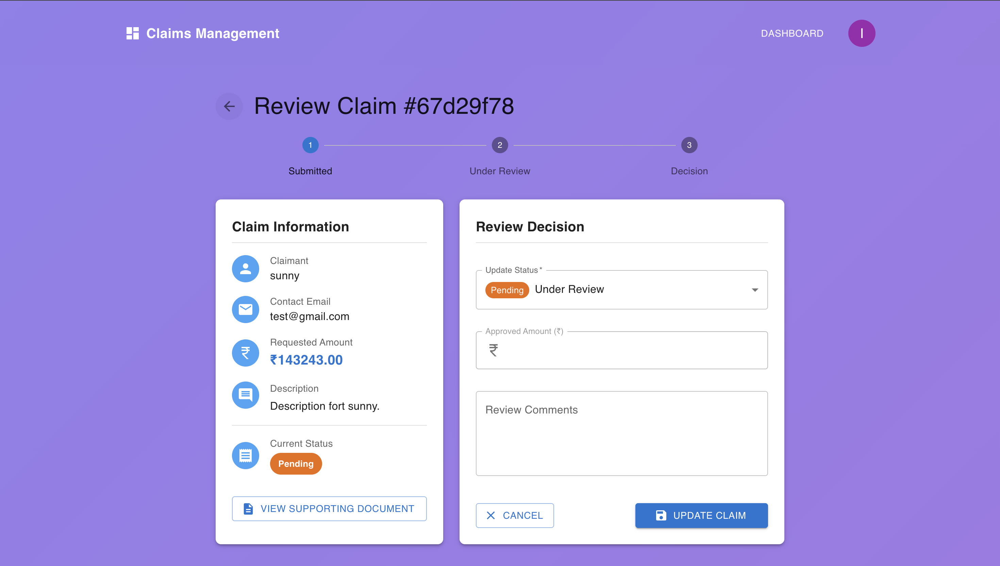

# 🚀 Minimal Claims Management Platform  

A **lightweight and efficient claims management platform** designed for both **patients** and **insurers**.  
Patients can **submit and track claims**, while insurers can **review and manage claims** seamlessly.  

🔗 **Live Demo**: [Minimal Claims Management Platform](https://minimal-claims.vercel.app/)  

## 🛠 Tech Stack  

| Technology | Usage |
|------------|-------|
| **Frontend** | React.js (for a responsive UI), Tailwind CSS, MUI |
| **Backend** | Node.js (NestJS) |
| **Database** | MongoDB |

---

## 📌 Features  

### 👩‍⚕️ Patient Side  
✅ **Submit a Claim**: Fill in details like **Name, Email, Claim Amount, Description**, and upload a document (e.g., receipt or prescription).  
✅ **View Claims**: Dashboard to **track claim status** (*Pending, Approved, Rejected*), see submission date, and view **approved amounts** (if applicable).  

### 🏦 Insurer Side  
✅ **Claims Dashboard**: View all submitted claims with **filters** for **status, date, and claim amount**.  
✅ **Manage Claims**: A review panel to:  
   - View **claim details & uploaded documents**  
   - **Approve/Reject** claims  
   - Assign an **approved amount**  
   - Leave **comments**  

### 🔄 Shared Features  
✅ **Authentication**: Basic login system for **patients and insurers**.  
✅ **API Development**: RESTful API endpoints for **submitting, fetching, and updating claims**.  
✅ **Database**: Stores claims with details such as **ID, Name, Email, Claim Amount, Status, Submission Date, and Insurer Comments**.  

---

## 🚀 Getting Started  

### 🔹 Prerequisites  
Ensure you have the following installed:  
- [Node.js](https://nodejs.org/)  
- [npm](https://www.npmjs.com/) or [yarn](https://yarnpkg.com/)  
- [MongoDB](https://www.mongodb.com/)  

### 🔹 Installation  

1. **Clone the repository**  
    ```sh
    git clone https://github.com/PARANDHAMAREDDYBOMMAKA/minimal-claims-management.git
    cd minimal-claims-management
    ```

2. **Set up the backend**  
    ```sh
    cd backend
    npm install
    ```

3. **Set up the frontend**  
    ```sh
    cd ../frontend
    npm install
    ```

---

## ⚙️ Configuration  

### 🔹 Backend  
Create a **`.env`** file inside the `backend` directory and add the following environment variables:  

```env
MONGO_URI=mongodb://localhost:27017/claims-management
JWT_SECRET=your_jwt_secret
JWT_EXPIRES_IN=1d
PORT=3000
```

### ▶️ Running the Application

1. Start the backend server:
    ```sh
    cd backend
    npm run start:dev
    ```

2. Start the frontend development server:
    ```sh
    cd ../frontend
    npm run dev
    ```

3. Open your browser and navigate to `http://localhost:5173` to access the application.

### Testing

1. Backend:
    ```sh
    cd backend
    npm run test
    ```

2. Frontend:
    ```sh
    cd ../frontend
    npm run test
    ```

## Screenshots

### Landing Page



### Registration




### Login


### Patient Dashboard


### Submit Claim Form


### Insurer Dashboard


### Claim Review Form

